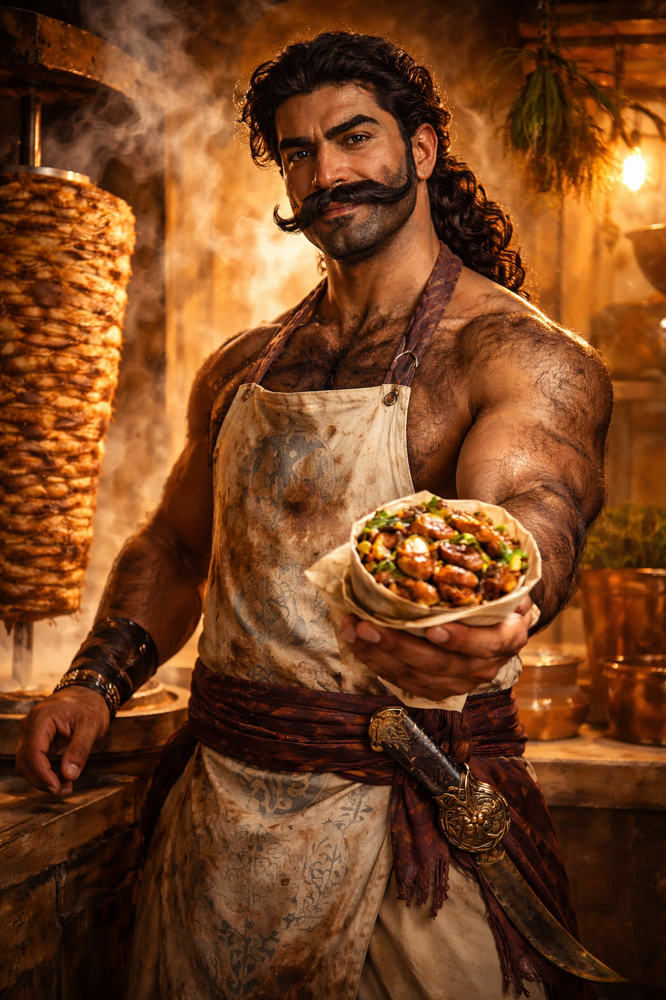
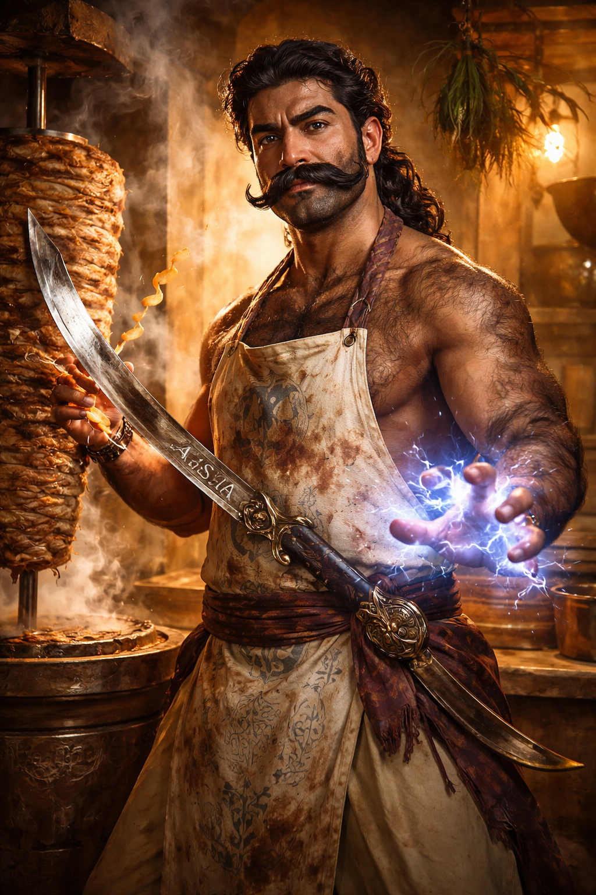

# The Shwarma Master — Level 16 Human Kensai Magus // Foresight Wizard (Gestalt)

**"The meat, the fire, the spice, the blade. Each has its rhythm. Each has its moment. The universe is a kebab — you must only know when to turn it."**

## Images

| | |
|---|---|
|  |  |

| | |
|---|---|
| **Race** | Human (Qadiran extraction) |
| **Classes** | Magus (Kensai) 16 // Wizard (Foresight Divination) 16 |
| **Alignment** | True Neutral |
| **Deity** | Nethys — patron of magic's dual nature: that which preserves and that which transforms. The Shwarma Master applies both to meat |
| **Size** | Medium |
| **Description** | Lean but hard-muscled from two decades at the spit. Dark olive skin, thick black hair on every surface it can grow — forearms, chest, back, knuckles. A single uninterrupted brow sits above watchful dark eyes. The mustache is enormous, oiled, and sculpted with meticulous pride — arguably his second-finest work, after the shwarma. He wears loose trousers and a stained apron tied with arcane sigils, both of which have survived grease fires, demon ichor, and worse sauces. [Aisha](#attacks), his scimitar, hangs at the hip; she smells faintly of cumin and ozone. |

## Class Table

| Slot | Class | Archetype | Hit Die |
|------|-------|-----------|---------|
| A | Magus 16 | Kensai | d8 |
| B | Wizard 16 | Divination (Foresight subschool) | d6 |

**Gestalt resolution**: d8 HD, 3/4 BAB (Magus), best of each save.

## Quick Nav

| Sheet Sections | Reference Files |
|---|---|
| [Ability Scores](#ability-scores) | [Spell Reference](spells.md) |
| [Combat Stats](#combat-stats) | [Class Features](features.md) |
| [Skills](#skills) | [Feats Reference](feats.md) |
| [Feats](#feats) | [Backstory](backstory.md) |
| [Character Traits](#character-traits) | |
| [Class Features](#class-features--quick-reference) | |
| [Racial Abilities](#racial-abilities) | |
| [Magus Spellcasting](#magus-spellcasting) | |
| [Wizard Spellcasting](#wizard-spellcasting) | |
| [Equipment](#equipment) | |
| [Build Decisions](#build-decisions) | |

---

## Ability Scores

19 point buy. +2 racial to INT. All 4 level-up bumps (4/8/12/16) to INT.

| Ability | Base | Racial | Level | Item | Inherent | Total | Mod | Notes |
|---------|------|--------|-------|------|----------|-------|-----|-------|
| STR | 14 | — | — | +4 (Belt) | — | **18** | **+4** | Melee damage |
| DEX | 14 | — | — | +4 (Belt) | — | **18** | **+4** | AC, Reflex, initiative |
| CON | 14 | — | — | +4 (Belt) | — | **18** | **+4** | HP, Fort, concentration |
| INT | 16 | +2 | +4 | +6 (Headband) | +2 (Tome) | **30** | **+10** | Casting, AC, init, crits, AoOs, pool — everything |
| WIS | 10 | — | — | — | — | **10** | **+0** | Will saves |
| CHA | 7 | — | — | — | — | **7** | **-2** | Dump — irrelevant for this build |

---

## Combat Stats

### AC

| Component | Bonus | Type | Source |
|-----------|-------|------|--------|
| Base | 10 | — | — |
| DEX | +4 | — | Ability |
| INT | +10 | Dodge | [Canny Defense](features.md#canny-defense) (Kensai, INT mod, cap = magus level 16) |
| Armor | +4 | Armor | [Mage Armor](spells.md#mage-armor) (16 hr, cast daily) |
| Shield | +4 | Shield | [Shield](spells.md#shield) (16 min, cast as needed) |
| Deflection | +3 | Deflection | [Ring of Protection +3](https://www.d20pfsrd.com/magic-items/rings/ring-of-protection/) |
| Natural Armor | +3 | Natural | [Amulet of Natural Armor +3](https://www.d20pfsrd.com/magic-items/wondrous-items/a-b/amulet-of-natural-armor/) |
| Insight | +1 | Insight | [Dusty Rose Prism Ioun Stone](https://www.d20pfsrd.com/magic-items/wondrous-items/h-l/ioun-stones/dusty-rose-prism-ioun-stone/) |

| | Total |
|---|---|
| **AC** (Mage Armor + Shield) | **39** |
| **AC** (Mage Armor only) | **35** |
| **Touch** | **28** (10 + 4 DEX + 10 Canny + 3 deflection + 1 insight) |
| **Flat-footed** (w/ Shield) | **25** (10 + 4 armor + 4 shield + 3 deflection + 3 natural + 1 insight; lose DEX and Canny Defense) |

Canny Defense is a dodge bonus — lost when denied DEX. However, [Iaijutsu](features.md#iaijutsu) allows AoOs even while flat-footed, and [Forewarned](features.md#forewarned) guarantees acting in surprise rounds, so flat-footed is rare.

Add [Mirror Image](spells.md#mirror-image) (1d4+5 images, 16 min) and/or [Greater Invisibility](spells.md#greater-invisibility) (16 rds) for additional miss chance layers.

### HP

| Source | HP | Notes |
|--------|-----|-------|
| Hit Die (L1) | 8 | d8 max at 1st |
| Hit Dice (L2–16) | 75 | 15 × 5 (d8, half+1) |
| CON modifier | 64 | 16 × +4 |
| **Total HP** | **147** | |
| **Current wounds** | — | |

FCB: +1 arcane pool/level (16 extra pool points) instead of HP.

### Saves

| Save | Base | Ability | Resistance | Total | Progression |
|------|------|---------|------------|-------|-------------|
| **Fort** | +10 | +4 (CON) | +5 (Cloak) | **+19** | Good (Magus) |
| **Ref** | +5 | +4 (DEX) | +5 (Cloak) | **+14** | Poor (both) |
| **Will** | +10 | +0 (WIS) | +5 (Cloak) | **+15** | Good (both) |

**Special saves:** [Moment of Prescience](spells.md#moment-of-prescience) (morning cast, 16 hrs) grants +16 insight to one save roll — hold for emergencies. [Prescience](features.md#prescience) pre-rolls a d20 each round for any roll including saves.

### Offense

| Stat | Value | Breakdown |
|------|-------|-----------|
| **BAB** | +12 | Magus 16 (3/4 BAB) |
| **Initiative** | **+22** | +4 DEX + 10 [Iaijutsu](features.md#iaijutsu) (INT) + 8 [Forewarned](features.md#forewarned) (half wizard level) |
| **Speed** | 30 ft. | Human base; 60 ft. with [Haste](spells.md#haste) |
| **CMB** | +16 | BAB +12 + STR +4 |
| **CMD** | **40** | 10 + 12 BAB + 4 STR + 4 DEX + 10 Canny Defense (dodge to CMD) |
| **Concentration (Magus)** | **+26** | CL 16 + INT 10 |
| **Concentration (Wizard)** | **+26** | CL 16 + INT 10 |

With [Greater Spell Combat](features.md#greater-spell-combat): take up to -5 on attacks to gain +10 concentration (double the penalty). Total concentration during Spell Combat with full penalty: **+36**.

### Attacks

**Weapon**: **Aisha**, +5 Scimitar (bonded item + Kensai chosen weapon). Named for his grandmother, the first to teach him that meat has a soul and that soul has an opinion about how it is treated.
**Crit Range**: 15–20/×2 ([Improved Critical](feats.md#improved-critical-scimitar) — 30% threat chance)

#### Full Attack (Spell Combat + Haste)

5 weapon attacks + 1 Spellstrike touch spell, all in one full-round action:

| Attack | AB | Damage | Crit | Notes |
|--------|-----|--------|------|-------|
| Spellstrike | +17 | 1d6+17 + spell | 15–20/×2 | Spell damage added (e.g. 10d6 [Shocking Grasp](spells.md#shocking-grasp)) |
| Iterative 1 | +17 | 1d6+17 | 15–20/×2 | Highest BAB |
| Haste | +17 | 1d6+17 | 15–20/×2 | Extra attack from [Haste](spells.md#haste) |
| Iterative 2 | +12 | 1d6+17 | 15–20/×2 | |
| Iterative 3 | +7 | 1d6+17 | 15–20/×2 | |

**AB breakdown**: +12 BAB + 5 weapon + 4 STR + 1 [Weapon Focus](feats.md#weapon-focus-scimitar) - 2 [Spell Combat](features.md#spell-combat) - 4 [Power Attack](feats.md#power-attack) + 1 [Haste](spells.md#haste) = **+17**

**Damage breakdown**: 1d6 (scimitar) + 4 STR + 5 weapon + 8 [Power Attack](feats.md#power-attack) = **1d6+17** (avg 20.5 per hit)

**Arcane Pool enhancement** (swift, 1 pt, 1 min): +4 equivalent in weapon properties. Recommended: Speed (+3) + Shock (+1) when Haste isn't running, or Flaming Burst (+2) + Frost (+1) + Shock (+1) when Haste is up.

**Spellstrike hit adds**: 10d6 electricity ([Intensified](feats.md#intensified-spell) [Shocking Grasp](spells.md#shocking-grasp)) = avg 35 damage, no save, +3 to hit vs metal armor. On a crit (15-20 range): spell does ×2 = 20d6 avg 70.

**With Spell Perfection (Quickened SG)**: Add a *second* Spellstrike as a swift action = **two Shocking Grasps per round** + 4–5 weapon attacks.

#### Nova Round Modifiers

| Modifier | AB | Damage | Action | Source |
|----------|-----|--------|--------|--------|
| [Arcane Accuracy](features.md#arcane-accuracy) | +10 | — | Swift, 1 pool | Magus arcana |
| [Accurate Strike](features.md#accurate-strike) | Resolve as touch | — | Swift, 1 pool | Magus arcana |
| [Bane Blade](features.md#bane-blade) | +2 | +2+2d6 | Swift, 1 pool | Magus arcana |
| [Prescience](features.md#prescience) | (pre-rolled d20) | — | Free | Foresight school, 13/day |
| [Maximized SG](feats.md#maximize-spell) | — | 60 flat | — | Via Spell Perfection or 3rd-level slot (with traits) |

#### Crit Confirmation

+12 BAB + 5 weapon + 4 STR + 1 WF + 10 [Critical Perfection](features.md#critical-perfection) (INT) + 4 [Critical Focus](feats.md#critical-focus) = **+36 confirm**. Auto-confirms against virtually anything. [Prescience](features.md#prescience) can pre-roll the confirmation die if needed.

#### AoOs

[Superior Reflexes](features.md#superior-reflexes): 10 AoOs/round (INT mod). [Combat Reflexes](feats.md#combat-reflexes): use DEX for AoO count (4). These stack: **14 AoOs/round** if enough targets provoke. [Counterstrike](features.md#counterstrike): enemies who cast defensively within reach provoke from you after completing.

---

## Skills

144 real ranks (9/level × 16: 2 class + 6 INT permanent mod + 1 human). Plus 48 phantom ranks from [Headband of Vast Intelligence +6](https://www.d20pfsrd.com/magic-items/wondrous-items/h-l/headband-of-vast-intelligence/) (3 skills × 16 HD).

Combined class skill list from both Magus and Wizard.

| Skill | Total | Ranks | Ability | Class | Other | Other Source |
|-------|-------|-------|---------|-------|-------|--------------|
| Spellcraft | **+29** | 16 | +10 INT | +3 | — | |
| K(Arcana) | **+29** | 16 | +10 INT | +3 | — | |
| K(Planes) | **+29** | 16 | +10 INT | +3 | — | |
| K(Dungeoneering) | **+29** | 16 | +10 INT | +3 | — | |
| Fly | **+23** | 16 | +4 DEX | +3 | — | |
| Use Magic Device | **+17** | 16 | -2 CHA | +3 | — | |
| Intimidate | **+17** | 16 | -2 CHA | +3 | — | |
| K(Religion) | **+23** | 10 | +10 INT | +3 | — | |
| K(Nature) | **+23** | 10 | +10 INT | +3 | — | |
| K(History) | **+23** | 10 | +10 INT | +3 | — | |
| Linguistics | **+20** | 7 | +10 INT | +3 | — | |
| K(Local)† | **+29** | 16 | +10 INT | +3 | — | Headband |
| K(Engineering)† | **+29** | 16 | +10 INT | +3 | — | Headband |
| K(Nobility)† | **+29** | 16 | +10 INT | +3 | — | Headband |
| Perception | **+10** | 10 | +0 WIS | — | — | Not class skill |
| Swim | **+7** | 0 | +4 STR | +3 | — | |
| Climb | **+7** | 0 | +4 STR | +3 | — | |

†Headband phantom ranks (16 each, treated as real ranks for all purposes after 24 hrs worn).

**Ranks spent**: 144/144 (real) + 48 (headband)

---

## Feats

| Level | Source | Feat | Type | Effect | Notes |
|-------|--------|------|------|--------|-------|
| 1 (Kensai) | Class | [Weapon Focus (scimitar)](feats.md#weapon-focus-scimitar) | Combat | +1 attack with scimitar | Free from Kensai |
| 1 | Character | [Intensified Spell](feats.md#intensified-spell) | Metamagic | +5 to damage dice cap | SG → 10d6; stays 1st-level via Magical Lineage |
| 1 (human) | Bonus | [Power Attack](feats.md#power-attack) | Combat | -4 atk / +8 dmg at BAB 12 | Reliable damage on iteratives |
| 3 | Character | [Spell Penetration](feats.md#spell-penetration) | General | +2 CL vs SR | Doubled by Spell Perfection |
| 5 | Character | [Empower Spell](feats.md#empower-spell) | Metamagic | +50% variable damage | Metamagic #2 toward Spell Perfection |
| 5 | Magus Bonus | [Combat Reflexes](feats.md#combat-reflexes) | Combat | DEX-based AoOs | Stacks with Superior Reflexes |
| 5 | Wizard Bonus | [Quicken Spell](feats.md#quicken-spell) | Metamagic | Cast as swift action (+4 levels) | Metamagic #3; Spell Perfection prereq met |
| 7 | Character | [Dimensional Agility](feats.md#dimensional-agility) | General | Act after Dimension Door | Chain start |
| 9 | Character | [Dimensional Assault](feats.md#dimensional-assault) | General | Teleport as charge | Chain middle |
| 10 | Wizard Bonus | [Improved Critical (scimitar)](feats.md#improved-critical-scimitar) | Combat | 15–20 crit range (doubled) | Saves weapon enchant slot vs Keen |
| 11 | Character | [Dimensional Dervish](feats.md#dimensional-dervish) | General | Full attack while teleporting | The payoff — teleport between attacks |
| 11 | Magus Bonus | [Critical Focus](feats.md#critical-focus) | Combat | +4 crit confirm | Qualifies via [Critical Perfection](features.md#critical-perfection) |
| 13 | Character | [Greater Spell Penetration](feats.md#greater-spell-penetration) | General | +4 total vs SR | Doubled to +8 by Spell Perfection |
| 15 | Character | [Spell Perfection](feats.md#spell-perfection) | General | Free metamagic on Shocking Grasp; double feat bonuses | Shocking Grasp target — free Quicken or Maximize |
| 15 | Wizard Bonus | [Maximize Spell](feats.md#maximize-spell) | Metamagic | Maximize variable damage (+3 levels) | 4th metamagic; use as free SP application for guaranteed 60 dmg |

**Feat chain summary**: 8 character feats + 1 human bonus + 2 magus bonus (combat) + 3 wizard bonus (metamagic/combat) + 1 Kensai free = **15 total**.

---

## Character Traits

| Trait | Type | Effect |
|-------|------|--------|
| [Magical Lineage](features.md#magical-lineage) (Shocking Grasp) | Magic | Reduce total metamagic adjustment by 1 for this spell |
| [Wayang Spellhunter](features.md#wayang-spellhunter) (Shocking Grasp) | Regional | Reduce total metamagic adjustment by 1 for this spell |

**Trait stack on Shocking Grasp (-2 total metamagic):**

| Metamagic Combo | Normal Level | With Traits | Slot Used |
|-----------------|-------------|-------------|-----------|
| Intensified SG | 2nd | **1st** | Bread and butter |
| Intensified + Empowered SG | 4th | **2nd** | 15d6 avg from a 2nd-level slot |
| Intensified + Maximized SG | 5th | **3rd** | Guaranteed 60 damage from a 3rd-level slot |
| Intensified + Quickened SG | 6th | **4th** | Swift-action 10d6 from a 4th-level slot |

---

## Class Features — Quick Reference

### Kensai Magus

| Level | Feature | Effect | Source |
|-------|---------|--------|--------|
| 1 | [Canny Defense](features.md#canny-defense) | +INT to AC as dodge bonus (cap = magus level). **+10 AC** | Replaces armor proficiency |
| 1 | [Weapon Focus](features.md#weapon-focus-scimitar) | Free Weapon Focus with chosen weapon (scimitar) | Kensai |
| 1 | [Spell Combat](features.md#spell-combat) | Full attack + cast a spell in same full-round action (-2 atk) | Core Magus |
| 1 | [Arcane Pool](features.md#arcane-pool) | 34 points/day; swift-action weapon enhancement | Core Magus |
| 2 | [Spellstrike](features.md#spellstrike) | Deliver touch spells through weapon at full crit range | Core Magus |
| 4 | [Perfect Strike](features.md#perfect-strike) | 1 pt: maximize weapon damage; 2 pts: +1 crit multiplier | Replaces Spell Recall |
| 7 | [Fighter Training](features.md#fighter-training) | Magus level -3 = fighter level for feat prereqs (chosen weapon feats only) | Replaces Knowledge Pool |
| 7 | [Iaijutsu](features.md#iaijutsu) | +INT to initiative (+10). AoOs while flat-footed. Free-action draw | Replaces Medium Armor |
| 8 | [Improved Spell Combat](features.md#improved-spell-combat) | +2 concentration on Spell Combat | Core Magus |
| 9 | [Critical Perfection](features.md#critical-perfection) | +INT to crit confirm (+10). Magus level = fighter level for critical feats | Replaces 9th arcana |
| 11 | [Superior Reflexes](features.md#superior-reflexes) | AoOs/round = INT mod (10). Stacks with Combat Reflexes | Replaces Improved Spell Recall |
| 13 | [Iaijutsu Focus](features.md#iaijutsu-focus) | Always act in surprise rounds. +INT damage vs flat-footed | Replaces Heavy Armor |
| 14 | [Greater Spell Combat](features.md#greater-spell-combat) | Concentration bonus = double attack penalty taken | Core Magus |
| 16 | [Counterstrike](features.md#counterstrike) | Enemies casting defensively in reach provoke AoO from you | Core Magus |

### Magus Arcana

| Level | Arcana | Effect | Cost |
|-------|--------|--------|------|
| 3 | [Arcane Accuracy](features.md#arcane-accuracy) | Swift: +INT (+10) to attack for 1 round | 1 pool pt |
| 6 | [Broad Study](features.md#broad-study) (Wizard) | Use Spell Combat and Spellstrike with Wizard spells | Passive |
| 12 | [Accurate Strike](features.md#accurate-strike) | Resolve all melee attacks as touch attacks for 1 round | 1 pool pt |
| 15 | [Bane Blade](features.md#bane-blade) | Swift: weapon gains bane (+2 enh, +2d6) vs current target | 1 pool pt |

### Foresight Divination (Wizard)

| Level | Feature | Effect | Source |
|-------|---------|--------|--------|
| 1 | [Forewarned](features.md#forewarned) | +8 initiative (half wizard level). Always act in surprise rounds | Divination school |
| 1 | [Prescience](features.md#prescience) | Free action: pre-roll d20, use for any roll before next turn. **13/day** | Foresight subschool |
| 8 | [Foretell](features.md#foretell) | 30 ft. aura: +2 luck to allies OR -2 to enemies. 16 rds/day | Foresight subschool |

**Opposition School**: Enchantment (1 opposition only — Divination's unique advantage). Enchantment spells can still be prepared using 2 slots.

**Bonded Item**: The scimitar (also Kensai chosen weapon). 1/day cast any wizard spell from spellbook without preparing it.

### Resource Summary

| Resource | Uses/Day | Notes |
|----------|----------|-------|
| Arcane Pool | 34 | 8 (half magus level) + 10 (INT) + 16 (human FCB) |
| Prescience | 13 | 3 + INT mod; free action pre-rolled d20 |
| Foretell | 16 rounds | Aura: +2 luck allies or -2 enemies |
| Perfect Strike | Pool-fueled | 1 pt maximize, 2 pts +1 multiplier |
| Bonded Item | 1 | Cast any wizard spell from spellbook, unprepared |

---

## Racial Abilities

| Trait | Effect | Replaces |
|-------|--------|----------|
| [Ability Score Modifier](features.md#ability-score-modifier) | +2 to one ability score (INT) | — |
| [Bonus Feat](features.md#bonus-feat) | Extra feat at 1st level | — |
| [Skilled](features.md#skilled) | +1 skill rank per level | — |
| [Languages](features.md#languages) | Common + bonus languages from INT | — |

---

## Magus Spellcasting

**Caster Level**: 16
**Base Save DC**: 10 + spell level + 10 (INT) = **20 + spell level**
**Concentration**: **+26** (CL 16 + INT 10); **+36** during Spell Combat with Greater Spell Combat (taking -5 atk for +10 conc)
**SR Penetration**: d20 + **20** (CL 16 + SP 2 + GSP 2); **d20 + 24** on [Spell Perfection](feats.md#spell-perfection) target (Shocking Grasp, doubled feat bonus)

Kensai has diminished spellcasting (one fewer spell per level than standard Magus).

### Magus Slots Per Day

| Level | Base (Kensai) | INT Bonus | Total |
|-------|---------------|-----------|-------|
| 0 (cantrips) | 5 | — | **5** (at will) |
| 1st | 4 | +3 | **7** |
| 2nd | 4 | +3 | **7** |
| 3rd | 4 | +2 | **6** |
| 4th | 3 | +2 | **5** |
| 5th | 2 | +2 | **4** |
| 6th | 0 | +2 | **2** |
| **Total** | | | **31** + cantrips |

### Key Magus Combat Spells

| Spell | Lvl | Action | Range | Duration | Effect | Source |
|-------|-----|--------|-------|----------|--------|--------|
| [Shocking Grasp](spells.md#shocking-grasp) | 1 | 1 std | Touch | Instantaneous | 10d6 electricity (Intensified), no save. +3 vs metal | Known |
| [Frostbite](spells.md#frostbite) | 1 | 1 std | Touch | Instantaneous | 1d6+16 per touch (16 charges), fatigues | Known |
| [Shield](spells.md#shield) | 1 | 1 std | Personal | 16 min | +4 shield AC, blocks Magic Missile | Known |
| [Mirror Image](spells.md#mirror-image) | 2 | 1 std | Personal | 16 min | 1d4+5 decoy images | Known |
| [Frigid Touch](spells.md#frigid-touch) | 2 | 1 std | Touch | Instantaneous | 4d6 cold + staggered 1 rd, no save | Known |
| [Vampiric Touch](spells.md#vampiric-touch) | 3 | 1 std | Touch | Instantaneous | 8d6 necrotic, gain as temp HP | Known |
| [Haste](spells.md#haste) | 3 | 1 std | Close | 16 rds | +1 atk/AC/Ref, extra attack, +30 speed | Known |
| [Dimension Door](spells.md#dimension-door) | 4 | 1 std | Long | Instantaneous | Teleport up to 1,120 ft. [Dimensional Dervish](feats.md#dimensional-dervish) fuel | Known |
| [Greater Invisibility](spells.md#greater-invisibility) | 4 | 1 std | Touch | 16 rds | Total concealment, persists through attacks | Known |

---

## Wizard Spellcasting

**Caster Level**: 16
**Base Save DC**: 10 + spell level + 10 (INT) = **20 + spell level**
**Concentration**: **+26** (CL 16 + INT 10)
**SR Penetration**: d20 + **20** (CL 16 + SP 2 + GSP 2); doubled to +24 on SP target
**School**: Divination (Foresight). **Opposition**: Enchantment.

All Wizard spells usable with [Spell Combat](features.md#spell-combat) and [Spellstrike](features.md#spellstrike) via [Broad Study](features.md#broad-study).

### Wizard Slots Per Day

| Level | Base + Specialist | INT Bonus | Total |
|-------|-------------------|-----------|-------|
| 0 (cantrips) | 4 | — | **4** (at will) |
| 1st | 4+1 | +3 | **8** |
| 2nd | 4+1 | +3 | **8** |
| 3rd | 4+1 | +2 | **7** |
| 4th | 4+1 | +2 | **7** |
| 5th | 4+1 | +2 | **7** |
| 6th | 3+1 | +2 | **6** |
| 7th | 3+1 | +1 | **5** |
| 8th | 2+1 | +1 | **4** |
| **Total** | | | **52** + cantrips |

### Key Wizard Spells — Touch (Spellstrike targets via Broad Study)

| Spell | Lvl | Action | Duration | Effect | Save |
|-------|-----|--------|----------|--------|------|
| [Touch of Idiocy](spells.md#touch-of-idiocy) | 2 | 1 std | 160 min | 1d6 penalty to INT, WIS, CHA. **No save** | None (mind-affecting) |
| [Calcific Touch](spells.md#calcific-touch) | 4 | 1 std | 16 rds | 1d4 DEX damage + slow per touch, 1/rd | Fort partial |
| [Bestow Curse](spells.md#bestow-curse) | 4 | 1 std | Permanent | -6 ability, -4 atk/saves, or 50% action loss | Will negates |

### Key Wizard Spells — Utility & Buffs

| Spell | Lvl | Action | Duration | Effect | Source |
|-------|-----|--------|----------|--------|--------|
| [Mage Armor](spells.md#mage-armor) | 1 | 1 std | 16 hr | +4 armor AC. Morning cast | Known |
| [Glitterdust](spells.md#glitterdust) | 2 | 1 std | 16 rds | Blind + outline invisible; **DC 22** Will neg blind | Known |
| [Dispel Magic](spells.md#dispel-magic) | 3 | 1 std | Instantaneous | d20+16 vs DC 11+CL | Known |
| [Teleport](spells.md#teleport) | 5 | 1 std | Instantaneous | Long-range party transport | Known |
| [Contingency](spells.md#contingency) | 6 | 30 min | 16 days | Auto-trigger spell on condition (e.g. Dimension Door when below 20 HP) | Known |
| [Greater Arcane Sight](spells.md#greater-arcane-sight) | 7 | 1 std | 16 min | Know every active spell on every creature within 120 ft. | Known |
| [Mind Blank](spells.md#mind-blank) | 8 | 1 std | 16 hr | Immunity to divination + mind-affecting. Morning cast | Known |
| [Moment of Prescience](spells.md#moment-of-prescience) | 8 | 1 std | 16 hr | +16 insight to one roll. Morning cast, hold for emergencies | Known |

### Combined Spell Slots: **83/day** (31 Magus + 52 Wizard) + cantrips

---

## Equipment

### Weapons

| Item | Cost | Enhancement | Notes |
|------|------|-------------|-------|
| **Aisha** — [+5 Scimitar](https://www.d20pfsrd.com/equipment/weapons/weapon-descriptions/scimitar/) | 50,315 gp | +5 enhancement | Bonded item + Kensai chosen weapon. Properties added via Arcane Pool each combat. Also used for shaving meat off the spit |

Aisha: 1d6, 18-20/×2 base (15-20 with [Improved Critical](feats.md#improved-critical-scimitar)). Arcane Pool adds +4 equivalent in properties (e.g. Speed + Shock, or Flaming Burst + Frost + Shock). Inscribed along the blade in flowing Kelish: *"That which transforms is also that which preserves."* A verse attributed to Nethys.

The **apron** is flavor for the [Cloak of Resistance +5](https://www.d20pfsrd.com/magic-items/wondrous-items/c-d/cloak-of-resistance/) — stained with every spice in the Inner Sea, scarred with oil burns in the shape of arcane sigils, and at this point it likely has opinions of its own.

### Worn Items

| Slot | Item | Effect | Cost |
|------|------|--------|------|
| Head | [Headband of Vast Intelligence +6](https://www.d20pfsrd.com/magic-items/wondrous-items/h-l/headband-of-vast-intelligence/) | +6 enhancement INT; 16 ranks in K(Local), K(Engineering), K(Nobility) | 36,000 |
| Belt | [Belt of Physical Perfection +4](https://www.d20pfsrd.com/magic-items/wondrous-items/a-b/belt-of-physical-perfection/) | +4 enhancement STR, DEX, CON | 64,000 |
| Shoulders | [Cloak of Resistance +5](https://www.d20pfsrd.com/magic-items/wondrous-items/c-d/cloak-of-resistance/) | +5 resistance to all saves | 25,000 |
| Ring 1 | [Ring of Protection +3](https://www.d20pfsrd.com/magic-items/rings/ring-of-protection/) | +3 deflection AC | 18,000 |
| Neck | [Amulet of Natural Armor +3](https://www.d20pfsrd.com/magic-items/wondrous-items/a-b/amulet-of-natural-armor/) | +3 natural armor enhancement | 18,000 |
| — | [Dusty Rose Prism Ioun Stone](https://www.d20pfsrd.com/magic-items/wondrous-items/h-l/ioun-stones/dusty-rose-prism-ioun-stone/) | +1 insight AC | 5,000 |
| — | [Tome of Clear Thought +2](https://www.d20pfsrd.com/magic-items/wondrous-items/r-z/tome-of-clear-thought/) | +2 inherent INT (already consumed) | 55,000 |

### Wealth Summary

| Category | Cost |
|----------|------|
| Weapon | 50,315 |
| Worn items & Tome | 221,000 |
| **Total spent** | **~271,315** |
| **WBL (level 16)** | 315,000 |
| **Remaining** | ~43,685 (scrolls, mundane gear, backup spellbook, component pouches) |

---

## Build Decisions

### Why This Gestalt Works — The Action Economy

This is the only gestalt combination where **both classes contribute every single round with zero waste**:

| Action Type | What Happens |
|-------------|-------------|
| **Full-round** | [Spell Combat](features.md#spell-combat): full attack with scimitar + cast a spell (Magus or Wizard via [Broad Study](features.md#broad-study)) |
| **Swift** | Round 1: [Arcane Pool](features.md#arcane-pool) weapon enhancement (lasts 1 min). Subsequent rounds: [Spell Perfection](feats.md#spell-perfection) Quickened [Shocking Grasp](spells.md#shocking-grasp) as second Spellstrike |
| **Free** | [Prescience](features.md#prescience) pre-rolled d20 for crit confirmation or save |
| **Passive** | Canny Defense (+10 AC), Iaijutsu (+10 init), Critical Perfection (+10 confirm), Superior Reflexes (10 AoOs), Forewarned (+8 init), all Wizard school abilities |

**No class sits idle.** The Wizard's spells are delivered through Magus mechanics (Spell Combat + Spellstrike). The Magus's martial framework is the delivery system for Wizard power. Both fire simultaneously.

### What Your Turn Looks Like

**Standard combat round (after round 1 setup):**
1. **Free action**: Prescience — pre-roll a d20
2. **Swift action**: Cast Quickened Intensified Shocking Grasp (free metamagic via Spell Perfection) → deliver as Spellstrike weapon attack at +17 for 1d6+17 + 10d6 electricity
3. **Full-round action**: Spell Combat — full attack (+17/+17/+12/+7 with Haste) + cast another Intensified Shocking Grasp, deliver as Spellstrike on one attack for 1d6+17 + 10d6

**Result**: 2 Shocking Grasps (20d6 total electricity = avg 70 spell damage) + 5 weapon attacks (avg 20.5 each = 102.5 weapon damage) = **~172 damage per round** before crits. With 30% crit chance on 5+ attacks, expect 1-2 crits per round adding another 35-70 damage.

**Dimensional Dervish round (vs scattered enemies):**
1. **Swift**: Quickened Shocking Grasp (Spell Perfection) → Spellstrike on first target
2. **Full-round**: Cast [Dimension Door](spells.md#dimension-door) via Spell Combat → [Dimensional Dervish](feats.md#dimensional-dervish) full attack, teleporting up to 1,120 ft. between attacks, hitting different targets

### Why Kensai over Base Magus

Base Magus eventually gets Medium and Heavy Armor. Kensai trades all armor for:
- **+10 AC** from INT (Canny Defense) — more than any armor provides, and applies to touch AC
- **+10 initiative** (Iaijutsu) — always go first
- **+10 crit confirmation** (Critical Perfection) — auto-confirm against almost anything
- **10 AoOs/round** (Superior Reflexes) — punish everything that moves near you

A base Magus in +5 Full Plate gets +14 armor AC but loses DEX to AC (max +1), can't use Wizard spells (arcane spell failure), and gains none of the Kensai's INT-based combat multipliers.

### Why Foresight Divination

1. **Only 1 opposition school** (every other school requires 2). Minimum sacrifice.
2. **Forewarned** (+8 initiative) stacks with Iaijutsu (+10 INT). Combined **+22 initiative** means you always go first.
3. **Prescience** (13/day pre-rolled d20) synergizes with the 15-20 crit range — pre-roll for crit confirmations on 30% of your attacks. Also usable for saves and skill checks.
4. **Foretell** (+2 luck aura for allies or -2 to enemies) is a free action economy buff.

### Why These Traits

[Magical Lineage](features.md#magical-lineage) + [Wayang Spellhunter](features.md#wayang-spellhunter) both reduce metamagic on Shocking Grasp by 1 level each. This means:
- Your bread-and-butter Intensified Shocking Grasp stays at 1st level
- Empowered Intensified SG (15d6 avg) fits in a 2nd-level slot
- Maximized Intensified SG (60 guaranteed) fits in a 3rd-level slot
- Quickened Intensified SG fits in a 4th-level slot

With 83 total spell slots per day, you never run dry.

### The Cooking Fiction

Mechanically this is a gestalt scimitar-mage. Narratively, every element is cooking:

| Mechanic | In Character |
|----------|-------------|
| [Shocking Grasp](spells.md#shocking-grasp) | Flash-grilling. The meat is seared the instant it meets the blade |
| [Frigid Touch](spells.md#frigid-touch) | Flash-freezing — the shock of cold tenderizes muscle and stuns whatever is wearing it |
| [Frostbite](spells.md#frostbite) | Slow marination through exposure |
| [Calcific Touch](spells.md#calcific-touch) | Mineralization. "Stone-ground" in the most literal sense |
| [Vampiric Touch](spells.md#vampiric-touch) | Extracting essence. Stock-making for the soul |
| [Bestow Curse](spells.md#bestow-curse) | Fermentation gone wrong. It happens |
| [Touch of Idiocy](spells.md#touch-of-idiocy) | "Food coma." A respected state |
| [Prestidigitation](spells.md#prestidigitation) | Seasoning. Cleaning. Plating. Used more than any other spell, by far |
| [Mage Armor](spells.md#mage-armor) | A thin layer of magical cooking oil that catches what the apron doesn't |
| [Haste](spells.md#haste) | "Kitchen rush" — the tempo of a dinner service applied to battle |
| [Arcane Pool](features.md#arcane-pool) | Heat management. A cook always knows how much flame is left |
| [Iaijutsu](features.md#iaijutsu) | The practiced flow of cutting the exact slice you need, at the exact moment, without looking |
| [Spell Combat](features.md#spell-combat) | The normal state of a working kitchen. You are always doing three things at once |

### Sources & Guides Consulted

**MCP Database**: All spells, feats, class features, racial traits, items, archetypes, and classes looked up via `pathfinder-data` MCP tools with `expand=True`. Kensai archetype from `search_archetypes(query='kensai', base_class='magus')`.

**Guides searched** (via `search_guides`):

| Guide | Query | What It Contributed |
|-------|-------|---------------------|
| [gestalt-guide](../../guides/gestalt-guide/) | full read | Kensai Magus // Wizard rated **Purple** (5-star). Action economy principles. Swift action conflict warnings |
| [magus-kurald](../../guides/magus-kurald/) | `Kensai`, `Broad Study` | Kensai rating by level, Broad Study usage notes, Bladebound stacking info |

**Web research**: Paizo forums, EN World, Giant in the Playground threads on gestalt optimization, Kensai Magus build guides, Dimensional Dervish interactions, Spell Perfection target analysis, Dervish Dance vs STR-based Spell Combat compatibility.
